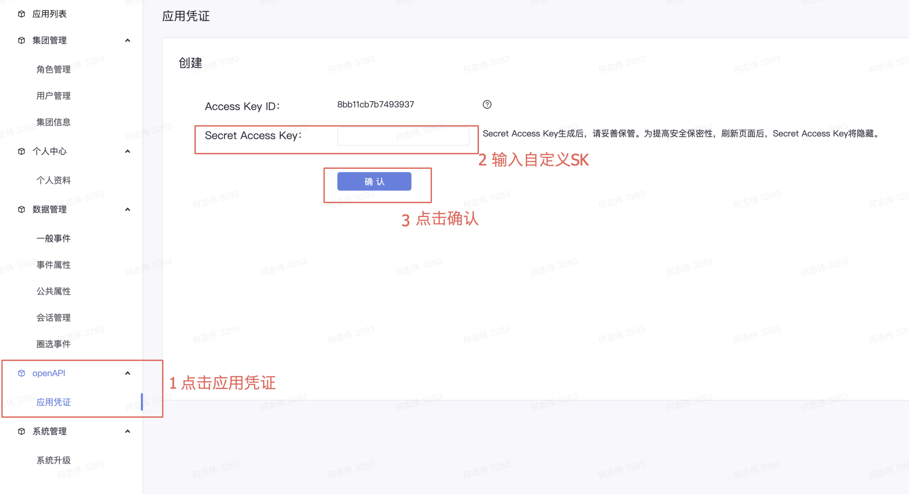

## DataRangers OpenApi PHP版本

### 入口类RangersClient
1. 构造函数
```php
/**
 * RangersClient constructor.
 * @param $ak :ak
 * @param $sk :sk
 * @param string $url :rangers域名 如https://analytics.volcengineapi.com
 * @param int $expiration :过期时间,用于AK SK认证,超过$expiration秒会返回超时,一般不需要配置
 */
public function __construct($ak, $sk, $url = "https://analytics.volcengineapi.com", $expiration = 1800);
```

2. 接口
```php
/**
 * @param $path :请求路径
 * @param string $method : 请求方法.get或者post
 * @param null $headers : 请求headers
 * @param null $params : 请求参数,一般get需要使用params
 * @param null $body : 请求内容,一般post需要带上body
 * @param int $timeout : 请求的超时时间
 * @return false|string(JSON)
 * @throws ClientNotSupportException
 */
public function dataRangers($path, $method = "GET", $headers = null, $params = null, $body = null, $timeout = 120);
public function analysisBase($path, $method = "GET", $headers = null, $params = null, $body = null, $timeout = 120);
public function dataFinder($path, $method = "GET", $headers = null, $params = null, $body = null, $timeout = 120);
public function dataTracer($path, $method = "GET", $headers = null, $params = null, $body = null, $timeout = 120);
public function dataTester($path, $method = "GET", $headers = null, $params = null, $body = null, $timeout = 120);
public function dataAnalyzer($path, $method = "GET", $headers = null, $params = null, $body = null, $timeout = 120);
public function dataProfile($path, $method = "GET", $headers = null, $params = null, $body = null, $timeout = 120);
```

说明: 
   1. 每个接口的函数名为请求的服务名,例如请求rangers的OpenAPI则使用dataRangers函数,如果请求DataFinder则使用dataFinder函数
   2. method为请求方法,为post或get


### DSL支持
使用构造器模式支持DSL的创建和查询
```php
$dsl = \DataRangers\DSLBuilder::funnelBuilder()
    ->appIds(0)
    ->rangePeriod("day", 1560268800, 1562774400)
    ->group("os_name")
    ->page(10, 2)
    ->window("day", 10)
    ->skipCache(false)
    ->andProfileFilter(\DataRangers\Expr::intExpr("user_is_new", "=", [0])
        ->stringExpr("network_type", "!=", ["4g,3g"])
        ->show("1", "老用户; not(4g, 3g)")
    )->query([\DataRangers\Expr::show("1", "查询1")
        ->sample(100)
        ->event("origin", "play_time", "pv")
        ->andFilter(\DataRangers\Expr::stringExpr("os_name", "=", ["windows"])
            ->show("referer_label", "referrer")
        ),
        \DataRangers\Expr::show("2", "查询2")->sample(100)
            ->event("origin", "app_launch", "pv")
    ])->build();
```

如果构造完成DSL,需要对DSL进行查询,则可以使用如下代码
```php
class TestClient
{
    private $ak = "";
    private $sk = "";
    private \DataRangers\RangersClient $client;

    /**
     * TestClient constructor.
     */
    public function __construct($ak, $sk)
    {
        $this->client = new \DataRangers\RangersClient($ak, $sk);
    }


    public function analysisRequest(\DataRangers\DSL $dsl)
    {
        echo $this->client->dataFinder("/openapi/v1/analysis", "post", null, null, json_encode($dsl));
    }

    public function testFunnel($dsl)
    {
        $this->analysisRequest($dsl);
    }
}
```

通过调用
```php
$testCase = new TestClient("ak", "sk");
$testCase-> testFunnel($dsl);//$dsl为生成的dsl
```

即可完成查询,返回的为查询结果

### 私有化中创建AK/SK
如下图所示

